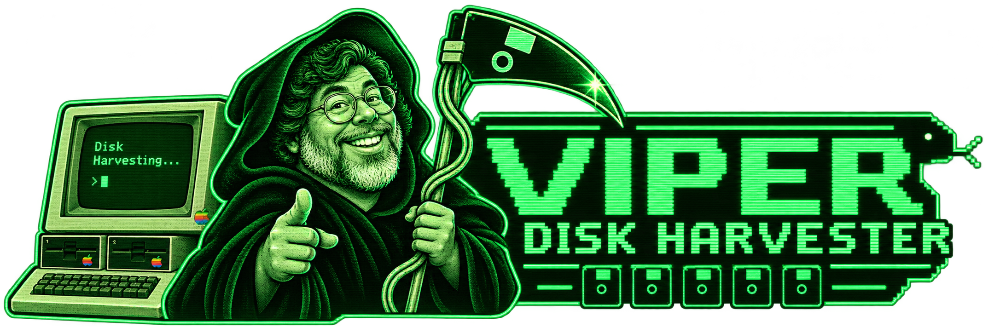

# Viper Disk Harvester



**Viper Disk Harvester** is a retro Apple II-themed Windows archive utility that recursively crawls the Asimov Apple II mirror and harvests supported disk-image formats into neatly separated local folders.

The interface is styled like a green-phosphor Apple II hacker terminal, with a Viper snake application icon and custom Woz-as-Grim-Reaper artwork.

## Supported disk formats

The current release discovers and downloads:

- `.dsk`
- `.woz`
- `.po`
- `.nib`
- `.hdv`

Files are automatically sorted into `DSK`, `WOZ`, `PO`, `NIB`, and `HDV` directories under the destination you choose.

## Features

- Recursively crawls `https://mirrors.apple2.org.za/ftp.apple.asimov.net/`
- Restricts crawling to the Asimov mirror tree
- One request/download at a time to avoid hammering the archive
- Three retry attempts for failed directory reads and downloads
- `.partial` files protect against incomplete downloads
- Existing completed files are skipped
- Filename collisions receive stable hash suffixes instead of being overwritten
- Writes a source URL list and filename map for provenance
- Embedded Viper Windows icon
- Embedded Woz Reaper header artwork
- No embedded PowerShell launcher
- Builds as a normal C# Windows Forms application

## Quick start

### Build it yourself

1. Clone or download this repository.
2. On Windows 10/11, double-click `Build-and-Run.cmd`.
3. The compiled program will be created at:

```text
dist\Viper-Disk-Harvester.exe
```

The build uses Microsoft's .NET Framework C# compiler that is available on many Windows installations.

### Use the program

1. Pick a destination root.
2. Click **SCAN ENTIRE SITE**.
3. Wait for the crawl to complete.
4. Review the discovered counts for DSK / WOZ / PO / NIB / HDV.
5. Click **DOWNLOAD ALL**.

The default layout is:

```text
E:\Apple II\AsimovHarvest\
├── DSK\
├── WOZ\
├── PO\
├── NIB\
├── HDV\
├── ViperDiskHarvester-URLs.txt
└── ViperDiskHarvester-filename-map.csv
```

## Security

The project intentionally avoids the earlier embedded-PowerShell wrapper design. The Windows program is compiled directly from readable C# source. See [docs/SECURITY.md](docs/SECURITY.md).

## Building on GitHub

A GitHub Actions workflow is included. Every push and pull request can compile the Windows executable and make it available as a workflow artifact. See [docs/BUILDING.md](docs/BUILDING.md).

## Responsible archive use

Viper Disk Harvester intentionally uses sequential requests and short delays. Please respect archive operators, bandwidth limitations, applicable site policies, and the rights associated with archived software.

## Artwork

The repository includes custom Viper Disk Harvester branding assets in `assets/`.

## Author

Created by **Viper**.

## License

No open-source license has been selected yet. Until a license is added, normal copyright rules apply. See [docs/LICENSING.md](docs/LICENSING.md) before publishing if you want others to reuse or modify the code.
